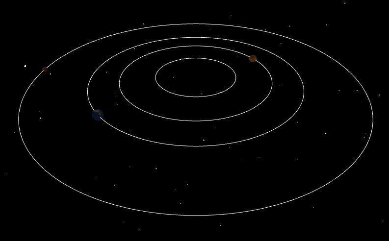

# Solar System
*Josh Bailey* 

## Contents
- [Solar System](#solar-system)
  - [Contents](#contents)
  - [Overview](#overview)
  - [Features](#features)

## Overview
A scaled model of the Solar System.

## Features
- Planet Diameter - 1 : 10,000km 
- Distance to Sun - 1 : 10,000,000km
- Earth Days to Complete Orbit - 1 : 10
- Earth Days to Complete Rotation - 1 : 0.1

